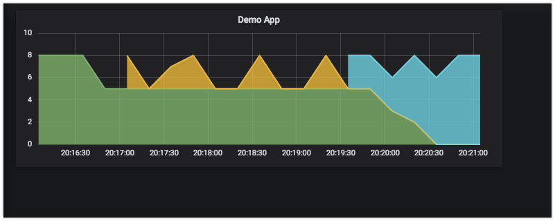

# Docker Cluster Tutorial

* Казань 2018 - https://devopsdays.com.ru
* DevOps Conf 2018 - http://devopsconf.io/

## Step by Step Guide

https://kb.selectel.ru/22060499.html - база знаний облака Селектела.

### Подготовка

1. Склонируйте данный репозитарий

2. Зарегистрируйте аккаунт в Селектеле/используйте готовый если есть. https://my.selectel.ru/ -> Зарегистрироваться -> Почта, Подтверждение, СМС, PROFIT!

3. Пополните баланс аккаунта/активируйте промокод, чтобы появились деньги на аккаунте приватного облака

4. Заведите новый проект на странице приватного облака - https://my.selectel.ru/vpc/projects

5. Добавьте публичную подсеть в регионе ru-1b, для этого нужно нажать раскрыть панель "Санкт-Петербург" и на вкладке "Ресурсы Дубровка-2 (ru-1b)" нажать кнопку "Добавить Публичную Подсеть"

6. Добавьте нового пользователя, на странице пользователей https://my.selectel.ru/vpc/users

7. Пользователя добавьте в проект, а таже прикрепите к пользователю свой ssh-ключ.

8. Скачайте файл `rc.sh` с настройками OpenStack API со страницы https://my.selectel.ru/vpc/access и положите его в корень данного репозитария

9. В файле `rc.sh` замените

```
echo "Please enter your OpenStack Password: "
read -sr OS_PASSWORD_INPUT
export OS_PASSWORD=$OS_PASSWORD_INPUT
```

на

```
export OS_PASSWORD=<пароль пользователя, прикрепленного к проекту>
export TF_VAR_KEY_PAIR=<имя ssh-ключа>
export TF_VAR_network01_id=<UUID публичной сети проекта>
export TF_VAR_main01_public_ip=<внешний IP-адрес главного сервера из публичной сети>
export TF_VAR_ACCOUNT_ID=$OS_PROJECT_DOMAIN_NAME
export TF_VAR_PASSWORD=$OS_PASSWORD
export TF_VAR_PROJ_ID=$OS_PROJECT_ID
export TF_VAR_USER=$OS_USERNAME
```

**NOTE:** из публичной сети `\29` доступно 5 адресов, самая простая мнемоника, если вам выдали сеть `5.189.236.216/29`, то первый адрес `CIDR + 2`, то есть `5.189.236.218`

10. Запустите докер контейнер с нужными утилитами с помощью команды:

```
docker build -t tools tools && docker run -it \
  -w /w \
  -v `pwd`:/w \
  -v $HOME/.ssh:/root/.ssh \
  tools bash
```

**NOTE:** все дальнейшие команды запускаются внутри контейнера.

11. Выполните в контейнере команду `source rc.sh`

12. Найдите актуальный UUID для Ubuntu 16.04

```
glance image-list | grep 'Ubuntu 16.04 LTS 64-bit'
```

13. Добавьте в конец `rc.sh`:

```
export TF_VAR_ubuntu_1604_v1=<UUID из прошлого списка>
```

**NOTE**: Если вы захотите позднее добавить сервер на более свежем
образе, то добавляйте новую переменную `..._v2`, `..._v3`, etc. Так как если поменять
старую, то терраформ попробует пересоздать диск с нуля.

14. Снова запустите команду `source rc.sh`

### Терраформим сервера

15. Создайте сервера

```
cd terraform
terraform init
terraform plan
terraform apply
cd ..
```

### Раскатываем ансиблом

16. Добавьте в `.ssh/config`:

```
Host 192.168.99.*
  ProxyCommand    ssh -W %h:%p root@<внешний IP-адрес главного сервера>
```

17. Раскатайте главный сервер:

```
cd ansible
ansible-playbook main.yml
cd ..
```

18. Теперь узлы:

```
cd ansible
ansible-playbook node.yml
cd ..
```

### Ставим софт

19. Запустите номад-задачи:

```
cat nomad/registry.nomad | ssh root@192.168.99.4 nomad run -
cat nomad/stats.nomad | ssh root@192.168.99.4 nomad run -
cat nomad/db.nomad | ssh root@192.168.99.4 nomad run -
cat nomad/prometheus.nomad | sed "s/__MAINIP__/$TF_VAR_main01_public_ip/g" | ssh root@192.168.99.4 nomad run -
cat nomad/grafana.nomad | sed "s/__MAINIP__/$TF_VAR_main01_public_ip/g" | ssh root@192.168.99.4 nomad run -
```

**NOTE**: Данный кластер подходит **исключительно** для учебных задач,
так как порты смотрят наружу и права внутри площадки никак не настроены.
Для любого вида продакшенов или запуска сервисов с данными - использование данного кластера **категорически** запрещено!

20. Посетите ссылки:

* http://<внешний IP-адрес главного сервера>.xip.io:8500 - consul
* http://<внешний IP-адрес главного сервера>.xip.io:4646 - nomad
* http://<внешний IP-адрес главного сервера>.xip.io:9998 - таблица раутинга <a href="https://github.com/fabiolb/fabio">fabio</a>
* http://prometheus.<внешний IP-адрес главного сервера>.xip.io:9999 - прометей
* http://grafana.<внешний IP-адрес главного сервера>.xip.io:9999/d/all/all - графана

### Деплой тестового приложения

21. Запустите первую версию приложения:

```
cat nomad/demo-app-v1.nomad | \
  sed "s/__MAINIP__/$TF_VAR_main01_public_ip/g" | \
  ssh root@192.168.99.4 nomad run -
```

22. Проверьте, что приложение открывается, понаблюдайте за графаной:

* http://demo-app.<внешний IP-адрес главного сервера>.xip.io:9999 - приложение v1
* http://grafana.<внешний IP-адрес главного сервера>.xip.io:9999/d/demo/demo-app - графана

23. Запустите битую версию приложения:

```
cat nomad/demo-app-v2.nomad | \
  sed "s/__MAINIP__/$TF_VAR_main01_public_ip/g" | \
  ssh root@192.168.99.4 nomad run -
```

24. Наблюдайте, как номад пытается поднять новую версию приложения:

* http://grafana.<внешний IP-адрес главного сервера>.xip.io:9999/d/demo/demo-app - графана


25. Запустите исправленную версию приложения:

```
cat nomad/demo-app-v3.nomad | \
  sed "s/__MAINIP__/$TF_VAR_main01_public_ip/g" | \
  ssh root@192.168.99.4 nomad run -
```

26. Проверьте, что приложение 3-й версии открывается, понаблюдайте за графаной, как обновляются контейнеры:

* http://demo-app.<внешний IP-адрес главного сервера>.xip.io:9999 - приложение v3
* http://grafana.<внешний IP-адрес главного сервера>.xip.io:9999/d/demo/demo-app - графана



### Останавливаем сервера

27. Полученный кластер тратит около 11 рублей в час, то есть промо-карточки на 500 рублей хватит примерно на двое суток непрерывной работы.
Но лучше деньги не тратить и удалить все сервера с помощью команды:

```
cd terraform
terraform destroy --force
cd ..
```

**NOTE:** публичную сеть, которая тоже тратит деньги, удалите вручную на главной странице облака - https://my.selectel.ru/vpc/projects.

28. Спасибо и до новых встреч!
